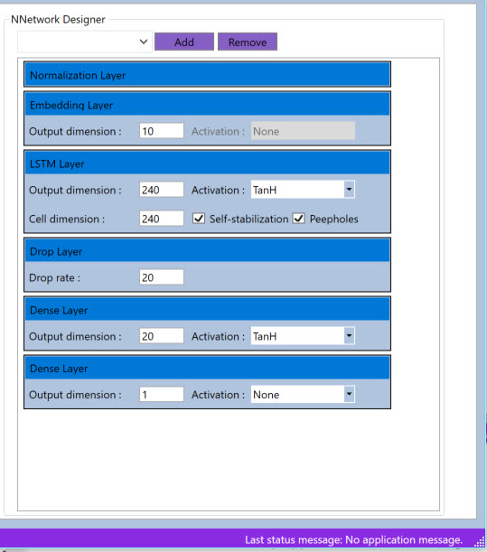

# ANNdotNET

ANNdotNET –  is an open source project for deep learning written in C# and .NET platform. The main purpose of the project is 
creating and training deep learning models. The application relies on Microsoft Cognitive Toolkit, CNTK, and it is 
supposed to be GUI tool for CNTK library with extensions in data preprocessing, model evaluation,
 exporting and deploying. The project is hosted at http://github.com/bhrnjica/anndotnet.   

The process of creating, training, evaluating and exporting models is provided from the GUI Application
 and does not require knowledge for supported programming languages. The ANNdotNET is ideal in several scenarios:

- more focus on network development and training process using on classic desktop approach, instead of focusing on coding, 
- less time spending on debugging source code, more focusing on different configuration and parameter variants,
- ideal for engineers/users which are not familiar with programming languages, 
- in case the problem requires coding custom models, or training process, ANNdotNET CMD provides high level of API for such implementation,
- all ml configurations developed with GUI tool,can be handling with CMD tool and vice versa.  

There are dozens of pre-calculated projects included in the installer which can be opened from the Start page as well as from CMD tool. The annprojects are
 based on famous datasets from several categories: regression, binary and multi class classification problems, image classifications, times series, etc.
In pre-calculated projects the user can find how to use various neural network configurations e.g. feed forward,
 deep neural network, LSTM recurrent nets, embedding and drop out layers. Also, each project can be modified
 in terms of change its network configuration, learning and training parameters, as well as create new ml configurations.

In order to handle with machine learning configuration file (*mlconfig*), ANNdotNET provides **neural network designer** (NNDesigner) capable of creating neural networks of any
 configurations and any combination of layers. The NNDesigner is based on layer concept, where user can easily add, delete or modify nn layers as simply as manipulating with the list view items.

     

# Software Requirements
ANNdotNET is x64 Windows desktop application which is running on .NET Framework 4.7.2. and .NET Core 2.0. In order to run the application, the following requirements must be met:

* Windows 7, 8 or 10 with x64 architecture
* .NET Framework 4.7.2 +
* .NET Core 2.0 +
* CPU/GPU support. 

Note: The application will automatically detect GPU capability on your machine and use it in training and evaluation, otherwise it will use CPU.

# How to run application
In order to run the application there are two possibilities:

## Run ANNdotNET from source code
1. Clone the GitHub repository http://github.com/bhrnjica/anndotnet 
2. Open anndotnet.sln in Visual Studio 2017,
3. Change build architecture of the solution into x64,
4. Right click on solution item and restore Nuget Packages, 
4. Press F5 for build and run the application.  

## Run ANNdotNET from release section
1. Got to http://github.com/bhrnjica/anndotnet/releases and find the ANNdotNET latest release,
2. Download the zip installer, and extract the content on  your disk,
3. Open extracted folder, select anndotnet.wnd.exe and run the application.
4. Once the application is run, select one of many pre-calculated projects
    placed on Start Page.

The following image shows Iris Flower Identification project opened in ANNdotNET
GUI Tool

## How to install ANNdotNET Excel AddIn 

In order to use ANNdotNET Export to Excel feature, the ANNdotNET.Excel.AddIn must be installed. In order to install Excel AddIn the following action must be performed:
- Install Microsoft Excel 64 bit version. **TheANNdotNET Excel AddIn is not compatible with Microsoft Excel 32bit version**.
- Open Excel and select: File -> Options

- From the Option Dialog select: Add-ins->ExcelAdd-ins -> press Go Button,

- From file open dialog, select: anndotnet.exceladdIn-AddIn64.xll, from the ANNdotNET binaries folder. 

- Add path to "ANNdotNET binaries folder" in system environment path, in order to register AddIn.

In case the PATH is not added the Excel addin must be installed every time you open Excel and use the Addin.

# Tutorial and Webcast
The following short videos quickly show how to create, train and evaluate regression, binary and multi class classification models.

* [ Regression model ](https://raw.githubusercontent.com/bhrnjica/anndotnet/master/Tutorials/anndotnetv1.mp4)
* [ Binary classification model ](https://raw.githubusercontent.com/bhrnjica/anndotnet/master/Tutorials/anndotnetv2.mp4)
* [ Multiclass classification model ](https://raw.githubusercontent.com/bhrnjica/anndotnet/master/Tutorials/anndotnetv3.mp4)

More info at https://bhrnjica.net/anndotnet/
