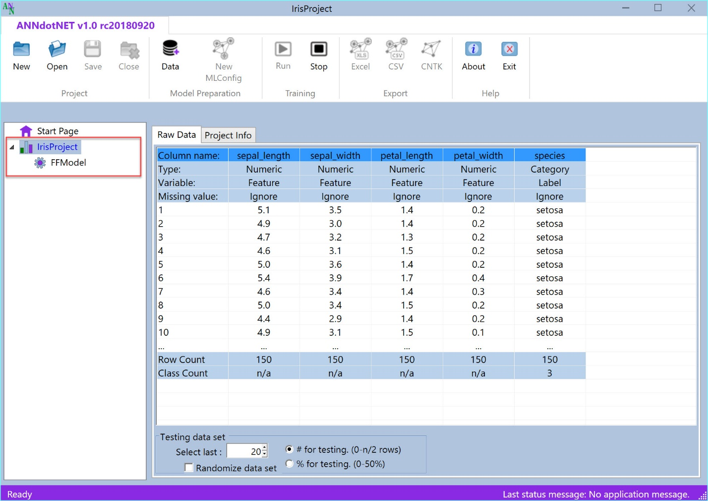
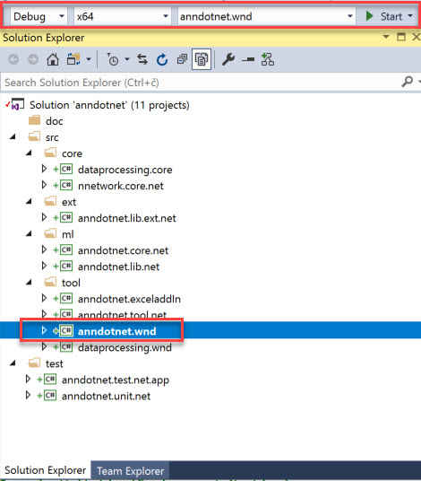
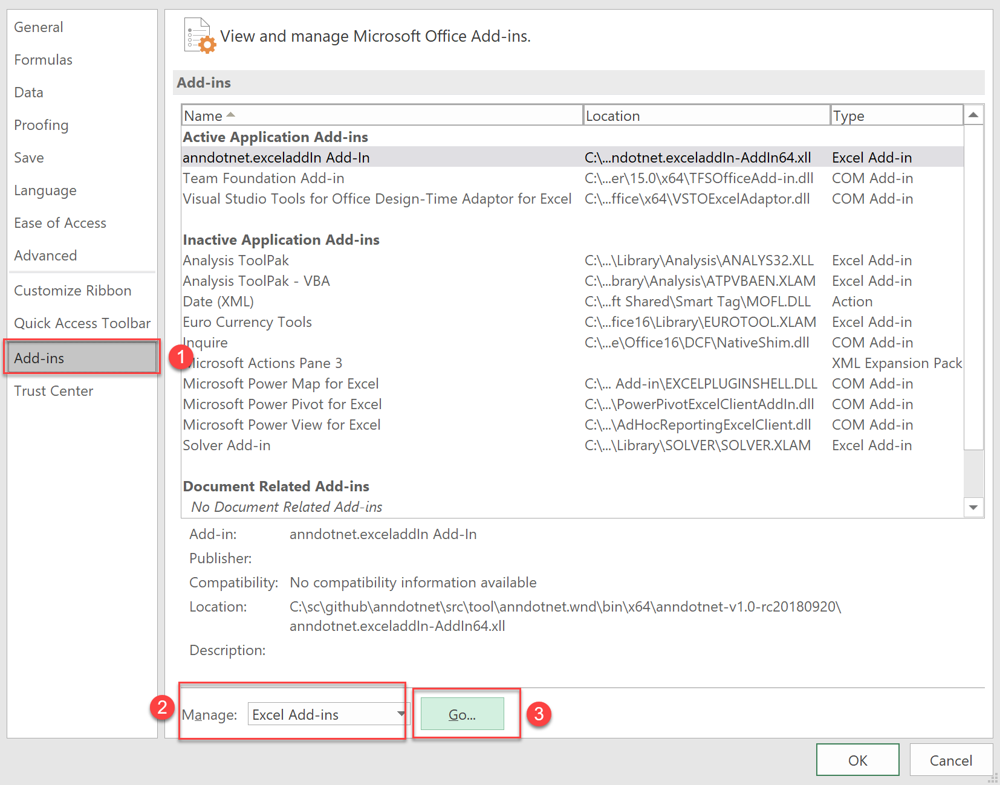
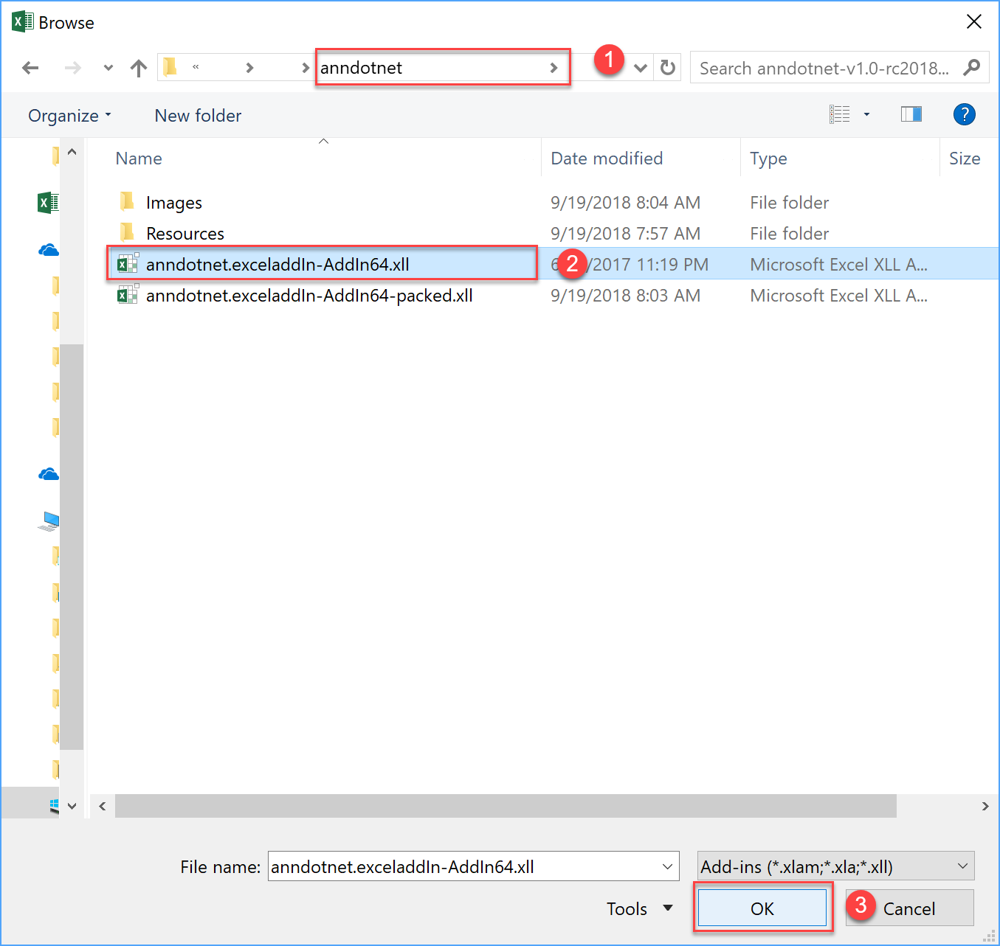
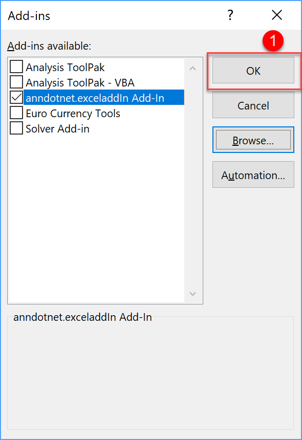
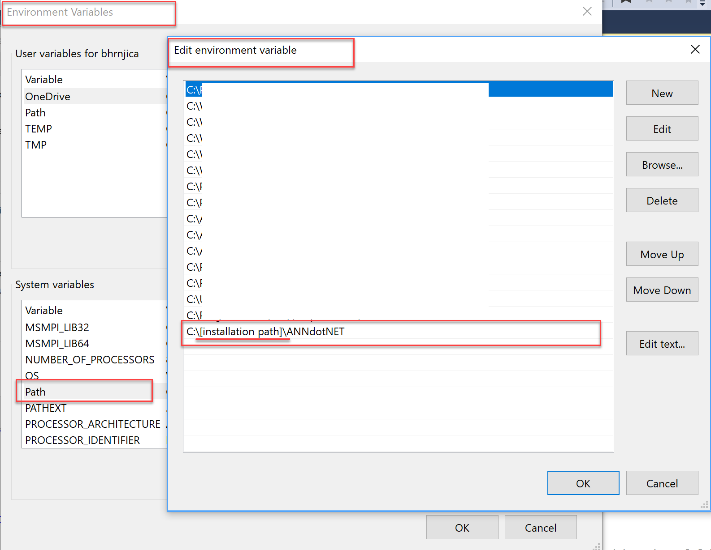

deep learning open source project

Introduction
============

ANNdotNET – is an open source project for deep learning written in C\# for
creating and training deep learning models. The application relies on Microsoft
Cognitive Toolkit, CNTK, and it is supposed to be GUI tool for CNTK library with
extensions in data preprocessing, model evaluation, exporting and deploying deep
learning models. It is hosted at <http://github.com/bhrnjica/anndotnet>.

Beside the fact it can be higher API for deep learning in
.NET, but also provides, data preparation and transformation from rawDataSet into mlreadyDataset, 
monitoring the training process with additional evaluation
functions, capability of early stopping during training, model evaluation and
validation, exporting and deployment options.
The process of creating, training, evaluating and exporting models is provided
from the GUI Application and does not require knowledge for supported
programming languages. The ANNdotNET is ideal for engineers which are not
familiar with programming languages. There are dozens of pre-calculated projects
included in the installer which can be opened from the Start page as well as
from Console tool. The projects are based on famous datasets from several
categories: regression, binary and multiclass classification problems, image
classifications, times series, ….

In pre-calculated projects the user can find how to use various neural network
configurations e.g. feed forward, deep neural network, LSTM recurrent nets,
embedding and drop out layers. Also, each project can be modified in terms of
change its network configuration, learning and training parameters, as well as
create new ml configurations.

In order to handle with machine learning configuration file (*mlconfig*), ANNdotNET provides **neural network designer** (NNDesigner) capable of creating neural networks of any
 configurations and any combination of layers. The NNDesigner is based on layer concept, where user can easily add, delete or modify nn layers as simply as manipulating with the list view items.

Note: The application automatically detects GPU capability on your machine and
use it in training and evaluation, otherwise it will use CPU. The installation process is easy, and doesn't require additional software installations.

Structure of the project 
-------------------------

The ANNdotNET open source project is Visual Studio based solution, contains
several projects grouped into logical solution folders. In order to build the
solution, the user need at least Visual Studio 2017 Community version which can
be freely downloaded.

ANNdotNET solution can be grouped on several components:

-   The library

-   CMD Tool

-   GUI Tool

-   Excel AddIn

-   Unit Tests and Test applications

**The library** consists of several dlls which logically separate the
implementation. It provides foundation of data processing and preparation,
neural network configuration and implementation of neural network layers,
training and handling with minibatches. The library also provides API for the
model evaluation, testing, export and deployment.

**CMD Tool** is console-based tool, which can be run from Visual Studio, and can
perform mlconfig handling, training and evaluation of models.

**GUI Tool** is Windows Desktop application which provides rich set of options
and visualizations during machine learning steps: project and mlconfig files
creation, data preparation, model training, evaluation and validation, export
options and model deployment. Currently only WPF based GUI Tool is implemented.
Easily it can be implemented ASP.NET or another web based or desktop-based GUI.

**Excel AddIn** is implementation of Microsoft Office AddIn for model deployment
in to Excel. Using ANNdotNET Excel AddIn, trained model can be used in Excel
like ordinary excel formula. This is very handy for model deployment into
production when only Excel is need in order to used the model.

**Unit Tests** – set of unit test and console projects which test implementation
of the library.

System requirements
-------------------

In order to run and develop ANNdotNET based solution the following system
requirements must be met:

-   Windows 8 x64 or higher,

-   Visual Studio 2017 (Community, Professional or Enterprise),

-   .NET Framework 4.7.2 and newer,

-   .NET Core 2.0 and newer

- [Visual C++ 2017 version 15.4 v14.11 toolset](https://aka.ms/vs/15/release/vc_redist.x64.exe)

- [Visual C++ Redistributable Packages for Visual Studio 2013](https://www.microsoft.com/en-us/download/details.aspx?id=40784)

-   Git source control tool.

More information about VC++ redistributable components can be found [here](https://support.microsoft.com/en-us/help/2977003/the-latest-supported-visual-c-downloads).

How to start with ANNdotNET CMD Tool
------------------------------------

In order to compile and build ANNdotNET solution, the following actions must be
performed:

1.  Clone solution by typing: git clone https://github.com/bhrnjica/anndotnet

2.  Run Visual Studio 2017 and open anndotnet.sln solution file.

3.  Set anndotnet.tool – as startup project

4.  Change system architecture of the solution from Any CPU to x64

1.  Once the previous actions are performed the Solution window looks like:

1.  From the Program.cs file select one of several implemented solutions
    uncomment the code and run the solution.

2.  Once the project is executed the following output is present:

The output Window start by problem title ( in this case “Iris Flower
Identification”), then depending on training parameters the training progress is
written in the console window. Once the training process is finished, the best
model is selected and evaluated against test dataset. The result of evaluation
is stored in csv file format which can be easily opened for further analysis.

How to start with ANNdotNET GUI Tool
------------------------------------

In order to start ANNdotNET GUI Tool, the user has two choices:

1.  Download stable version of ANNdotNET GUI Tool from Release section, or

2.  Compile and run the project from Visual Studio

### How to run ANNdotNET GUI Tool from release section

This option is handy in case you don't have installed Visual Studio or you want
to use the application without source code. The following actions should be
performed:

-   Download binaries from the release section at:
    https://github.com/bhrnjica/anndotnet/releases,

-   Unzip the binaries on your machine and run \`anndotnet.wnd.exe\` exe file.

-   Once the application is run, select one of many pre-calculated projects
    placed on Start Page.

The following image shows Iris Flower Identification project opened in ANNdotNET
GUI Tool

### How to run ANNdotNET GUI Tool from source code

The second option is similar as in case of ANNdotNET CMD Tool. Only difference
is the startup project which in this case should be \`anndotnet.wnd\`, and it is
shown on the image below.

To recap the section, once the user download the source code and open it by
using Visual Studio, the **anndotnet.wnd** should be selected as startup
project. Beside startup project, user also should change the system architecture
to x64, and press F5. Once the Visual Studio compiles and builds the solution,
the ANNdotNET windows desktop application is shown on the user’s machine.

## How to install ANNdotNET Excel AddIn 

In order to use ANNdotNET Export to Excel feature, the ANNdotNET.Excel.AddIn must be installed. In order to install Excel AddIn the following action must be performed:
- Install Microsoft Excel 64 bit version. **The ANNdotNET Excel AddIn is not compatible with Microsoft Excel 32bit version**.
- Open Excel and select: File -> Options

- From the Option Dialog select: Add-ins->ExcelAdd-ins -> press Go Button,

- From file open dialog, select: anndotnet.exceladdIn-AddIn64.xll, from the ANNdotNET binaries folder. 

- Add path to "ANNdotNET binaries folder" in system environment path, in order to register AddIn.

In case the PATH is not added the Excel addin must be installed every time you open Excel and use the Addin.

