<http://bhrnjica.net/anndotnet>

Brief Introduction to ANNdotNET
===============================

ANNdotNET – is an open source project for deep learning on .NET platform (.NET
Framework and .NET Core). The project is hosted at
<http://githubcom/bhrnjica/anndotnet>. More information can be found at Wiki
page of the GitHub portal, or t the <http://bhrnjica.net/anndotnet>.

The project comes in two versions: GUI and CMD tool. The main purpose of the
project is focus on building deep learning models without to be distracted with
debugging the source code and installing/updating missing packages and
environments. The user should no worry which version of ML Engine the
application is using. In other words, the ANNdotNET is ideal in several
scenarios:

1.  more focus on network development and training process using classic desktop
    approach, instead of focusing on coding,

2.  less time spending on debugging source code, more focusing on different
    configuration and parameter variants,

3.  ideal for engineers/users which are not familiar with supported programming
    languages,

4.  in case the problem requires coding more advanced custom models, or training
    process, ANNdotNET CMD provides high level of API for such implementation,

5.  all ml configurations developed with GUI tool, can be handled with CMD tool
    and vice versa.

With ANNdotNET GUI Tool the user can prepare data for training, by performing
several actions: data cleaning, feature selection, category encoding, missing
values handling, and create training and validation dataset prior to start
building deep neural network. Once the data is prepared, the user can create
Machine Learning Configuration (mlconfig) file in order to start building and
training deep neural network. All previous actions user can handle using GUI
tool implemented in the application.

For persisting all data preparation and transformation actions, the application
uses annproject file type which consists information about raw dataset, metadata
information and information about machine learning configuration files.

The machine learning configurations are stored in separated files with mlconfig
file extension. For more information about files in ANNdotNET the reader may
open this
[link](https://github.com/bhrnjica/anndotnet/wiki/File-Structure-in-ANNdotNET).
The following image shows how ANNdotNET handles annproject and corresponded
machine learning configurations within the annproject:

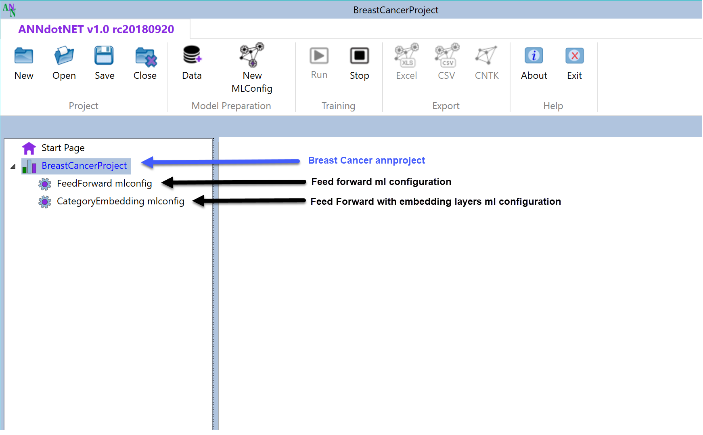

As can be seen the annproject can be consisted of arbitrary number of mlconfigs,
which is typical scenario when working on ML Project. User can switch between
mlconfigs any time except when the application is in training or evaluation
mode.

ANNdotNET ML Engine
===================

ANNdotNET introduces the ANNdotNET Machine Learning Engine (MLEngine) which is
responsible for training and evaluation models defined in the mlconfig files.
The ML Engine relies on Microsoft Cognitive Toolkit, CNTK open source library
which is proved to be one of the best open source library for deep learning.
Through all application ML Engine exposed all great features of the CNTK e.g.
GPU support for training and evaluation, different kind of learners, but also
extends CNTK features with more Evaluation functions (RMSE, MSE, Classification
Accuracy, Coefficient of Determination, etc.), Extended Mini-batch Sources,
Trainer and Evaluator.

ML Engine also contains the implementation of neural network layers which
supposed to be high level CNTK API very similar as layer in Keras and other
python based deep learning APIs. With this implementation the ANNdotNET
implements the Visual Neural Network Designer called ANNdotNET NNDesigner which
allows the user to design neural network configuration of any size with any type
of the layers. In the first release the following layesr are implemented:

-   Normalization Layer – takes the numerical features and normalizes its values
    before getting to the network. More information can be found
    [here](https://bhrnjica.net/2018/07/13/input-normalization-as-separate-layer-in-cntk-with-c/).

-   Dense – classic neural network layer with activation function

-   LSTM – LSTM layer with option for peephole and self-stabilization.

-   Embedding – Embedding layer,

-   Drop – drop layer.

Designing the neural network can be simplify by using pre defined layer. So on
this way we can implement almost any network we usually can implement through
the source code.

How to use ANNdotNET NNDesigner
===============================

Once the MLConfig is created user can open it and start building neural network.
NNDesigner is placed in the Network Setting tab page. The following image shows
the Network Setting tab page.

NNetwork Designer contains combo box with supported NN layers, and two action
buttona for adding and removing layers in/from the network. Adding and removing
layers is simple as adding and removing items in/from the list box. In order to
add the layer, select the layer from the combo box, and press Add button. In
order to remove the layer form the network, click the layer in the listbox and
press Remove button, then confirm deletion. In order to successfully create the
network, the layer must be created with the same output dimension as the Output
layer shown on the left side of the window, otherwise the warning messages will
appear about this information once the training is stared.

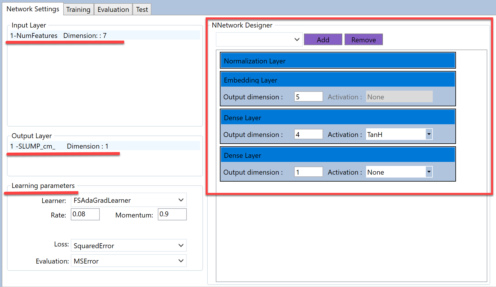

Depending on the type, once the layer is added to the network it must be
configured. The main parameter for each layer is output dimension and activation
function, except the drop and normalization layer. The following text explains
parameters for all supported layers:

>   *Normalization layer* – does not require any parameter. The following image
>   shows the normalization item in the NNDesigner. You can insert only one
>   normalization layer, and it is positioned at the first place.

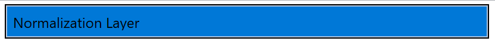

>   *Drop layer* - requires percentage drop value which is integer. The
>   following image shows how drop layer looks in the NNDesigner. The drop out
>   value is in percentage type. There is no any constrains for this layer.

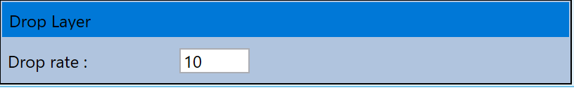

>   *Embedding layer* – requires only output dimension to be configured. There
>   is no any constrains for the layer. The following image shows hot it looks
>   in the NNDesigner:

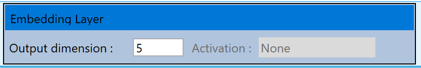

>   *Dense layer* – requires output dimension and activation function to be
>   configured. There is no any constrains for the layer.

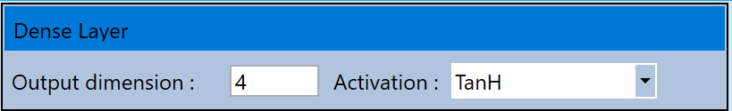

>   *LSTM layer* – requires: output and cell dimension, activation function, and
>   two Boolean parameters to enable peephole and self-stabilization variant in
>   the layer. The following image shows how LSTM item looks in the NNDesigner.

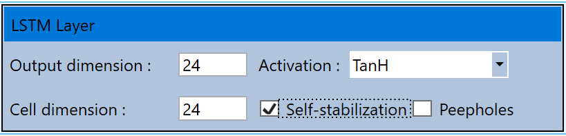

The LSTM layer has some constrains which is already implemented in the code. In
case thwo LSTM layer is added in the network, the network becomes the Stacked
LSTM which should be treated differently. Also LSTM layer is always inserted as
stack, and they cannot be inserted on different places in the list. The
implementation of the Stacked LSTM layer will be shows later.

Diferent network configurations
===============================

In this section, various network configuration will be listed, in order to show
how easy is to use NNDesigner to create very complex neural network
configurations. Network examples are implemented in pre-calculated examples
which come with default ANNdotNET installation package.

Feed Forward network
====================

This example shows how to implement Feed Forward network, with one hidden and
one output layer which is the last layer in the NNDesinger. The example is part
of the ANNdotNET installation package.

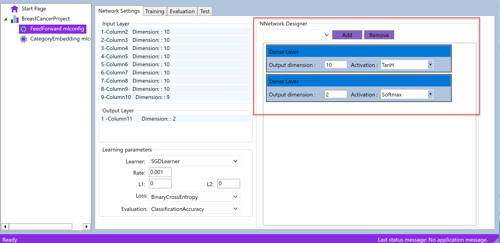

Feed Forward with Normalization layer
=====================================

Tis example shows feed forward network with normalization layer as the first
layer. The example of this configuration can be found in the installation
package of the ANNdotNET.

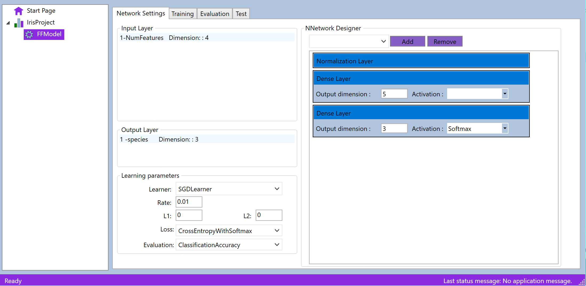

Feed Forward Network with Embedding layers
==========================================

In this example embedding layers are used in order to reduce the dimensions of
the input layer. The example is part of the ANNdotNET installation package.
Network is configured with 3 embedding layers, one hidden and output layer.

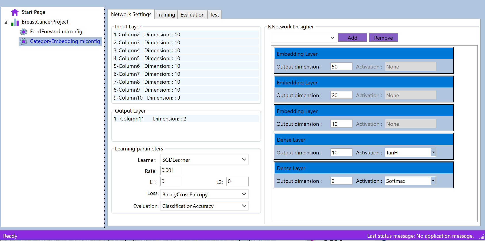

Deep Neural Network
===================

This example shows Deep neural network with three kind of layers: Embeddings,
Drop and Dense layers. The project is part of the ANNdotNET installation
package.

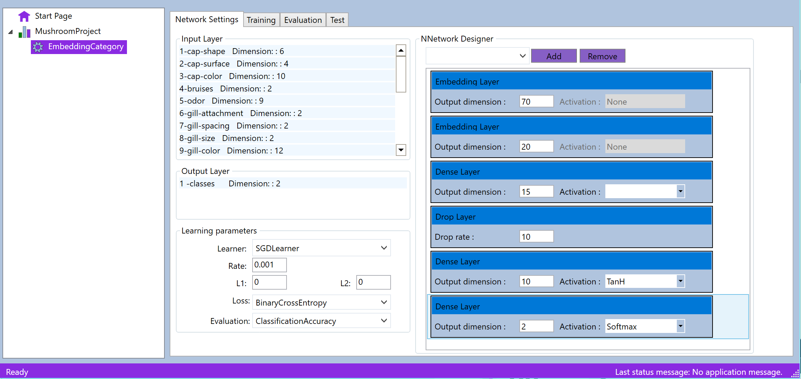

LSTM Deep Neural Network
========================

This example shows how to configure LSTM based network. The example is part of
the ANNdotNET installation package. The network consist of Normalization,
Embedding, Drop, Dense and LSTM layers. The project is part of the ANNdotNET
installation package.

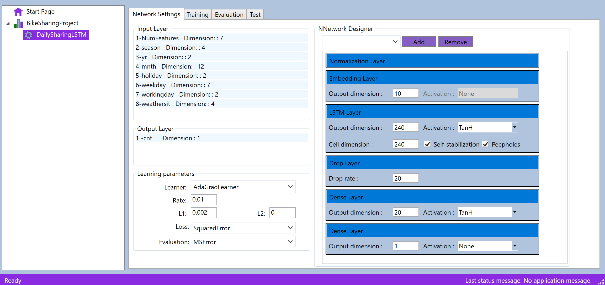

Stacked LSTM Neural Network
===========================

This is example of Stacked LSTM network, consist of multiple LSTM layers
connected into stack. The example is part of the installation package.

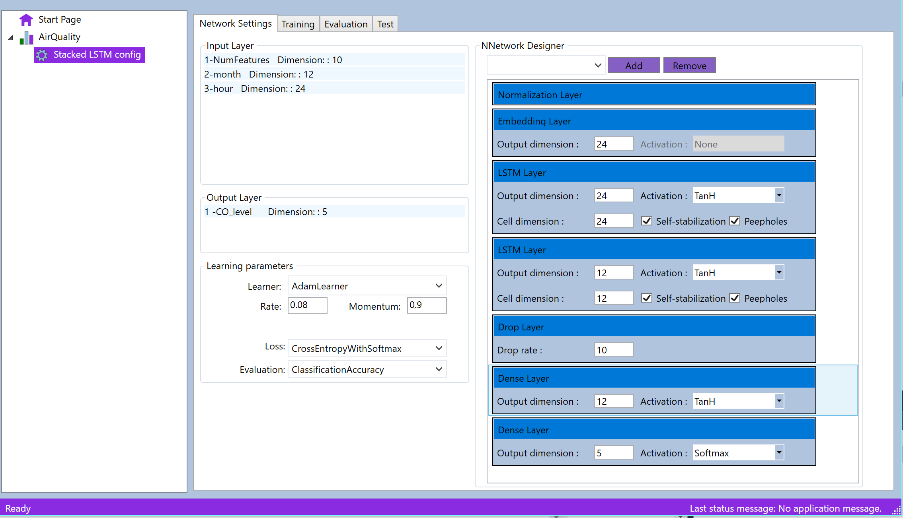

The complete list of examples can be seen at the ANNdotNET Start Page. In order
to open the example, the user just need to click the link.
