deep learning open source project

Introduction
============

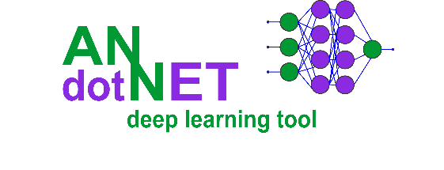

ANNdotNET – is an open source project for deep learning. The project is written
in C\# on .NET Core platform, except GUI Tool which is written in .NET
Framework. The project can be run as standard Windows Desktop application, but
also provides API and infrastructure to run as a Console Application in .NET
Core.

The project is based on Microsoft CNTK (CogNitive ToolKit) Microsoft open source
library for deep learning. It is supposed to be higher API for deep learning in
.NET, but also provides, data preparation and transformation from rawDataSet in
to mlreadyDataset, monitoring the training process with additional evaluation
functions, capability of early stopping during training, model evaluation and
validation, exporting and deployment options.

The process of creating, training, evaluating and exporting models is provided
from the GUI Application and does not require knowledge for supported
programming languages. The ANNdotNET is ideal for engineers which are not
familiar with programming languages. There are dozens of pre-calculated projects
included in the installer which can be opened from the Start page as well as
from Console tool. The projects are based on famous datasets from several
categories: regression, binary and multiclass classification problems, image
classifications, times series, ….

In pre-calculated projects the user can find how to use various neural network
configurations e.g. feed forward, deep neural network, LSTM recurrent nets,
embedding and drop out layers. Also, each project can be modified in terms of
change its network configuration, learning and training parameters, as well as
create new ml configuration.

In order to change ml configuration, ANNdotNET implement*s network designer*
capable of creating neural network of any configuration, and any combination of
layers. The network designer is based on layer concept which the user can add,
delete or modify simply as list view items.

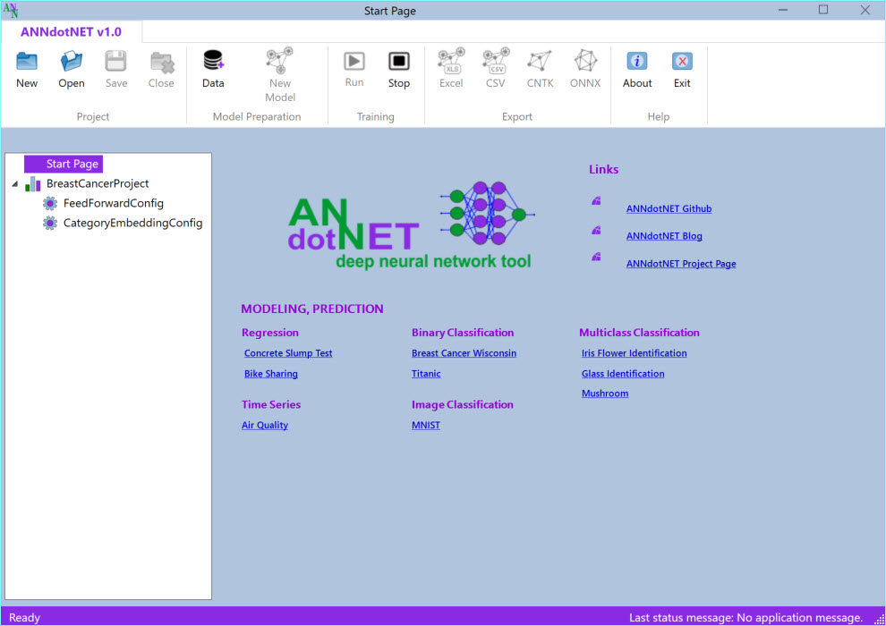

Note: The application automatically detects GPU capability on your machine and
use it in training and evaluation, otherwise it will use CPU.

Structure of the project 
-------------------------

The ANNdotNET open source project is Visual Studio based solution, contains
several projects grouped into logical solution folders. In order to build the
solution, the user need at least Visual Studio 2017 Community version which can
be freely downloaded.

ANNdotNET solution can be grouped on several components:

-   The library

-   CMD Tool

-   GUI Tool

-   Excel AddIn

-   Unit Tests and Test applications

**The library** consists of several dlls which logically separate the
implementation. It provides foundation of data processing and preparation,
neural network configuration and implementation of neural network layers,
training and handling with minibatches. The library also provides API for the
model evaluation, testing, export and deployment.

**CMD Tool** is console-based tool, which can be run from Visual Studio, and can
perform mlconfig handling, training and evaluation of models.

**GUI Tool** is Windows Desktop application which provides rich set of options
and visualizations during machine learning steps: project and mlconfig files
creation, data preparation, model training, evaluation and validation, export
options and model deployment. Currently only WPF based GUI Tool is implemented.
Easily it can be implemented ASP.NET or another web based or desktop-based GUI.

**Excel AddIn** is implementation of Microsoft Office AddIn for model deployment
in to Excel. Using ANNdotNET Excel AddIn, trained model can be used in Excel
like ordinary excel formula. This is very handy for model deployment into
production when only Excel is need in order to used the model.

**Unit Tests** – set of unit test and console projects which test implementation
of the library.

System requirements
-------------------

In order to run and develop ANNdotNET based solution the following system
requirements must be met:

-   Windows 8 x64 or higher,

-   Visual Studio 2017 (Community, Professional or Enterprise),

-   .NET Framework 4.7.2 and newer,

-   .NET Core 2.0 and newer

-   Git source control tool.

How to start with ANNdotNET CMD Tool
------------------------------------

In order to compile and build ANNdotNET solution, the following actions must be
performed:

1.  Clone solution by typing: git clone https://github.com/bhrnjica/anndotnet

2.  Run Visual Studio 2017 and open anndotnet.sln solution file.

3.  Set anndotnet.tool – as startup project

4.  Change system architecture of the solution from Any CPU to x64

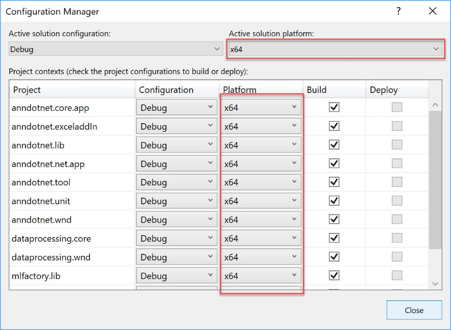

1.  Once the previous actions are performed the Solution window looks like:

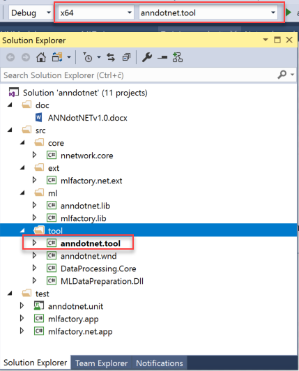

1.  From the Program.cs file select one of several implemented solutions
    uncomment the code and run the solution.

2.  Once the project is executed the following output is present:

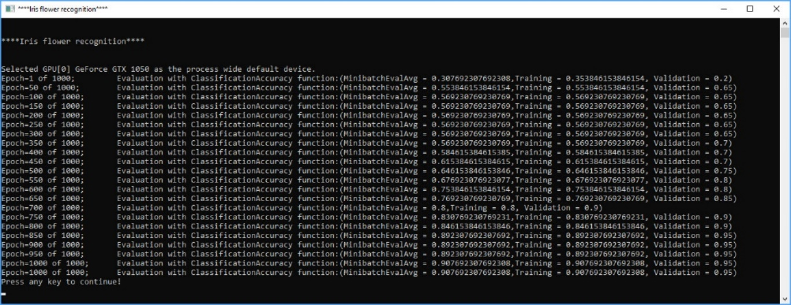

The output Window start by problem title ( in this case “Iris Flower
Identification”), then depending on training parameters the training progress is
written in the console window. Once the training process is finished, the best
model is selected and evaluated against test dataset. The result of evaluation
is stored in csv file format which can be easily opened for further analysis.

How to start with ANNdotNET GUI Tool
------------------------------------

In order to start ANNdotNET GUI Tool, the user has two choices:

1.  Download stable version of ANNdotNET GUI Tool from Release section, or

2.  Compile and run the project from Visual Studio

### How to run ANNdotNET GUI Tool from release section

This option is handy in case you don't have installed Visual Studio or you want
to use the application without source code. The following actions should be
performed:

-   Download binaries from the release section at:
    https://github.com/bhrnjica/anndotnet/releases,

-   Unzip the binaries on your machine and run \`anndotnet.wnd.exe\` exe file.

-   Once the application is run, select one of many pre-calculated projects
    placed on Start Page.

The following image shows Iris Flower Identification project opened in ANNdotNET
GUI Tool

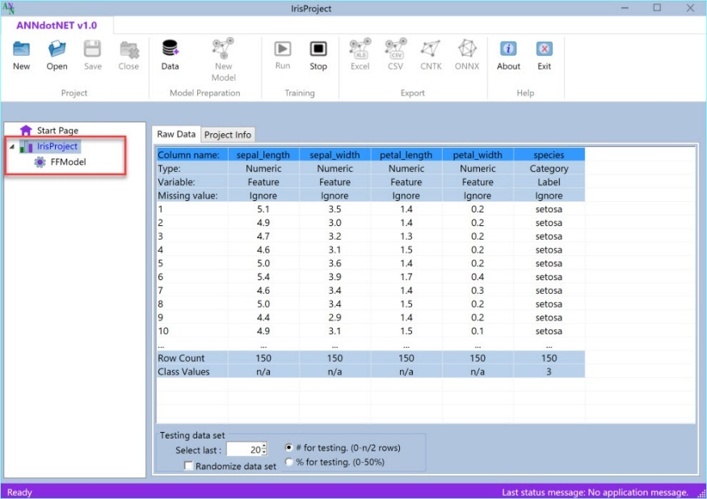

### How to run ANNdotNET GUI Tool from source code

The second option is similar as in case of ANNdotNET CMD Tool. Only difference
is the startup project which in this case should be \`anndotnet.wnd\`, and it is
shown on the image below.

To recap the section, once the user download the source code and open it by
using Visual Studio, the **anndotnet.wnd** should be selected as startup
project. Beside startup project, user also should change the system architecture
to x64, and press F5. Once the Visual Studio compiles and builds the solution,
the ANNdotNET windows desktop application is shown on the user’s machine.

Files in ANNdotNET
==================

Introduction to mlconfig and annproject files
---------------------------------------------

The basic file of ANNdotNET is machine learning configuration file, shortly
named mlconfig. The mlconfig file holds the information about: features, labels,
learning and training parameters, neural network model and set of paths required
for running machine learning solution. Whenever an user presses Run button from
ANNdotNET GUI Tool or Run command/method from ANNdotNET CMD, the training
process start by loading the mlconfig file into application memory.

Furthermore, the ANNdotNET GUI Tool uses annproject file (\*.ann) which can hold
information of one or more mlconfig files. The user start creating new mlconfig
file first by pressing New button. Then the user must load the raw dataset. Once
the user finished with project creation and loading raw dataset in the project,
then the new mlconfig based on the project settings and raw dataset can be
created. The following image shows Breast Cancer annproject created based on the
BreatsCancer dataset. The project consists of two mlconfig files. Each ml config
file holds different ml configuration. This is very handy in case you want to
find best possible neural network model for different ml configuration. This is
natural way of doing data science.

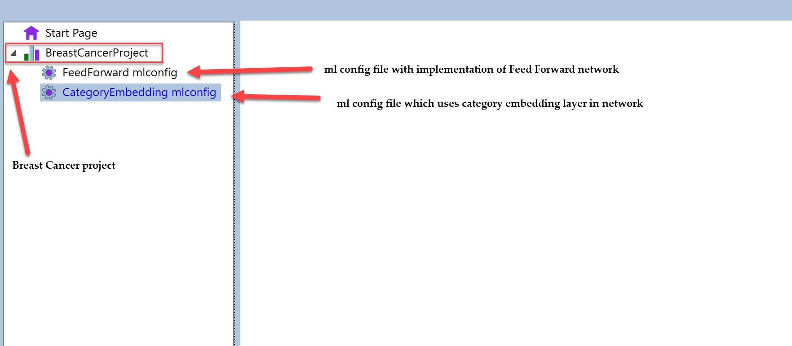

On the other hand, ANNdotNET CMD is based on mlconifg file only. It can handle
only one filer per session. Any mlconfig file created with GUI tool can be run
with ANNdotNET CMD.

How to create mlconfig and annproject files
-------------------------------------------

There are two ways how to create mlconfig and annproject files:

1.  Using ANNdotNET GUI tool, or

2.  Manually by using any txt-based editor.

Press New button command in ANNdotNET GUI in order to start creating a new
project. Once the project is created, user must load raw dataset in order to
create ml config file.

To create mlconfig file manually, please see section about manualy create
mlconfig file.

File structure in ANNdotNET
---------------------------

Once the user presses the New button, the empty project is created. While
creating a new project, the project file and project folder are created on disk.
We can illustrate file and folder structure as follows:

Say we create a new project called “Project01”. The folder named “Projcet01” is
created, as well as project file named “Projct01.ann”. Those two items are shown
on the following image:

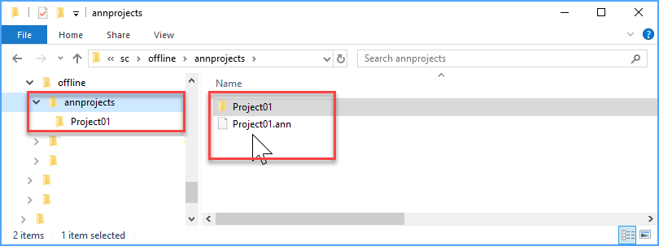

Once the project (annproject) is created, we can load raw dataset file. The raw
dataset file (rawDataSet) is the file contains data of the problem we are going
to solve using the tool. The structure of the rawDataSet is classic table-based
textual data. For example we can load
<https://archive.ics.uci.edu/ml/machine-learning-databases/iris/iris.data> file
directly into ANNdotNET and start processing the data in order to implement ml
solution.

Once we load the rawDataSet, the project file structure now looks like on the
following image.

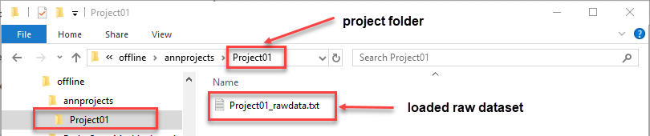

Notice, that rawDataSet file is created in the project folder and renamed
according to the ANNdotNET naming convention. So, loaded rawDataSet is renamed
to [ProjectName]_rawdata.txt

Now that we have annproject and rawDataSet, we can create ml configuration
(mlconfig) file. The mlconfig file is created when the user press Create
MLConfig button from the application’s ribbon control. Within the same project,
we can create as many ml configuration as we want, with different forms,
structure and size of training and validation dataset, also with different
network, learning and training parameters.

The following image shows the ANNdotNET project with created 4 ml
configurations: Model0, Model1, Model2 and Model3.

For each ml configuration separate folder is created, which offers clean and
easy way to follow file structures. Each ml configuration contains folders and
files arranged within the folder. The following image shows files and folder
structure of ANNdotNET ml configuration.

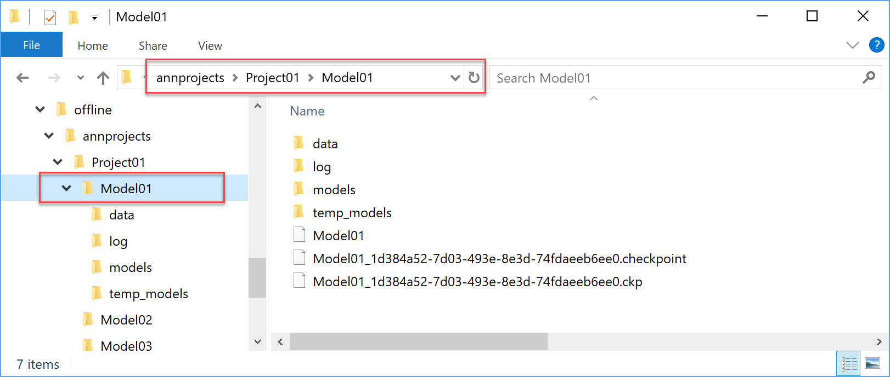

Depending of stage of completeness, the ml configuration can consist of the
following folders:

-   data – contains training, validation and testing ml ready data set,

-   log – contains files of training information

-   models – files of cntk format created during various phase of training

-   temp_models – folder holding temporary model files during training. All
    content from the folder is deleted once the trainer is stopped.

Files which can be found at the ml configuration folder are:

-   mlconfig – ml configuration file, it contains the information for training,
    validation and evaluating model.

-   model checkpoint state files – files stored current state of the trainer.
    The files are needed in case when the user want to continue with training
    based on the previous trainer state.

The process of creating mlconfig file, starts by data transformation where the
rawdataset transforms into training and validation mlreadyDataset. The
mlreadyDataset is the data set which is created from the rawDataSet, with
format, features and label definition which the CNTK library can recognize.

annproject file
===============

In this section it will be briefly described the structure of the annproject
file. The annproject file consists of 4 keywords:

1.  project: - contains information of the project

2.  data: - contains information about raw dataset.

3.  parser: - parser information while parsing rawdataset file.

project: - contains the following parameters:

-   Name: – name of the annproject,

-   ValidationSetCount: - the size of validation dataset,

-   PrecentigeSplit: - is the validation dataset size in percentage while
    creating it,

-   MLConfigs: - list of created ml configurations,

-   Info: - project info.

For example, the following text represent typical annproject :

>   !annprojct file for daily solar production

>   project:\|Name:SolarProduction \|ValidationSetCount:20 \|PrecentigeSplit:1
>   \|MLConfigs:LSTMMLConfig \|Info:

>   !raw dataset and metadata information

>   data:\|RawData:SolarProduction_rawdata.txt
>   \|Column01:time;Ignore;Ignore;Ignore;
>   \|Column02:solar.past;Numeric;Feature;Ignore;
>   \|Column03:solar.current;Numeric;Label;Ignore;

>   !parser information

>   parser:\|RowSeparator:rn \|ColumnSeparator: ; \|Header:0 \|SkipLines:0

The text above defined the project Solar production annproject, where raw
dataset stored in SolarProduction_rawdata.txt, and contains three columns: time,
solar.past and solar.total columns. The first column (time) is marked as ignored
which means it will be excluded from the creation of the ml ready dataset. The
solar.past column is marked as feature, and solar.current is marked as label.
Both feature and label are numeric column. Those information is enough that
ANNdotNET tool can created ml ready datasets.

The last parser keyword is used while the raw datset is loaded into the memory.

mlconfig file
=============

In this section it will be briefly described the structure of the mlconfig file,
and how to create it from scratch. The mlconfig file consist of 8 keywords:

1.  configid: - unique identifier of the mlconfig,

2.  metadata:- meta information about dataset.

3.  features: - defines features for the model

4.  labels: - defines labels for the model

5.  network: - defines neural network model to be trained

6.  learning: - defines learning parameters,

7.  training: - defines training parameters,

8.  path – defines paths to files needed during training and evaluation.

Each above keyword consists of several parameters and values. The syntax of the
mlconfig file allows you to create as many empty lines as you like. In case you
want to add comment in the file, the sentence must begin with exclamation ‘!’.
Order of the keywords is irrelevant.

For example, the following content represent typical mlconfig file:

>   !\*\*\*\*\*\*\*ANNdotNET v1.0\*\*\*\*\*\*\*\*\*\*\*\*

>   !Iris mlconfig file iris.mlconfig

>   !configid represent the unique identified of the configuration

>   **modelid**:33fe0968-d640-4b53-97dc-982dcf2b1cad

>   !metada contains information about data set.

>   **metadata**:\|Column01:sepal_length;Numeric;Feature;Ignore;
>   \|Column02:sepal_width;Numeric;Feature;Ignore;
>   \|Column03:petal_length;Numeric;Feature;Ignore;
>   \|Column04:petal_width;Numeric;Feature;Ignore;
>   \|Column05:species;Category;Label;Ignore;setosa;versicolor;virginica

>   !Information about features. The line contains

>   ! two groups of features: NumericFeatures and Product fetaure

>   **features**:\|NumFeatures 4 0 \|Product 10 0

>   !Information about label

>   **labels**:\|species 3 0

>   !Network configuration

>   **network**:\|Layer:Normalization 0 0 0 None 0 0 \|Layer:Dense 5 0 0 ReLU 0
>   0 \|Layer:Dense 3 0 0 Softmax 0 0

>   !Learning parameter information

>   learning:\|Type:SGDLearner \|LRate:0.01 \|Momentum:1
>   \|Loss:CrossEntropyWithSoftmax\|Eval:ClassificationAccuracy\|L1:0\|L2:0

>   !Training parameters information

>   **training**:\|Type:default \|BatchSize:65 \|Epochs:1000 \|Normalization:0
>   \|RandomizeBatch:False \|SaveWhileTraining:1 \|ProgressFrequency:50
>   \|ContinueTraining:0
>   \|TrainedModel:models\\model_at_952of1000_epochs_TimeSpan_636720117054117391

>   !Components of the mlconfig paths

>   **paths**:\|Training:data\\mldataset_train
>   \|Validation:data\\mldataset_valid \|Test:data\\mldataset_valid
>   \|TempModels:temp_models \|Models:models \|Result:FFModel_result.csv
>   \|Logs:log

configid
--------

this GUID value is generated automatically and supposed to be unique identifier
for the mlconfig file. When mlconfig file is created manualy, it can be any
string value.

metada:
-------

The metadata keyword contains meta information about dataset. The information is
arranged as list of columns, where each column contains: name, type, kind of
variable and missing value type.

>   metadata:\|Column01:[name] [type] [kind] [missingtype]  
>   \|Column02:[name] [type] [kind] [missingtype]  
>   ...

The number of columns must be the same as number of dimensions of features and
labels.

features: and labels:
---------------------

When describing features and labels in mlconfig file, the following signatures
should be applied:

>   features:\|[featurename1] [dimension] [isSparsedata]  
>   \|[featurename2] [dimension] [isSparsedata]  
>   ...

>   labels:\|[labelname1] [dimension] [isSparsedata]  
>   \|[labelname2] [dimension] [isSparsedata]  
>   ...

Each feature and label must be defined with 3 parameters:

-   name,

-   dimension,

-   sparsdata.

So, in case of iris dataset features are define:

>   features:\|irismeasures 4 0  
>   labels:\|species 3 0

It means the iris dataset has 4 features which is grouped in “irismeasures”
name, with 4 dimensions, which identifies 4 features and it is not sparse data.
The labels is defined as species with one-hot encoding vector of 3 classes

Assume we have an example for features and labels definition with the following
case:

>   features:\|year 3 1 \|month 12 1\|shop 52 1\|item 5100 1\|cnt_past3m 3 0

>   labels:\|item_cnt_month 1 1 0

As can be seen, in this example there are 5 different group of features. The
features are described in the following text:

1.  feature name = year, with dimension of 3, and it is sparse data (1).

2.  feature name = item, with 5100 dimensions, and this feature is sparse data
    (1).

3.  feature name= cnt_past3m, with 3 dimensions, and this data is not (0)
    sparse.

4.  label name= item_cnt_month, with 1 dimension, and it is not (0) sparse data.

Definition of features and labels are closely related on how mlready dataset is
generated. In case of the above definition one row for corresponded mlready
dataset is given as:

>   \|year 2:1 \|item 3906:1 \|cnt_past3m 0.02696543 0.02696543 0.02696543
>   \|item_cnt_month 0.02696543

We can see that the row defines with 3 groups of features and one group of
labels. Two features are category and one is numeric feature. Also label is of
numeric type, since it has only one dimension.

It is recommended to review other examples to see how the features and labels
defined.

network: 
=========

network: keyword defines the network model. It can be of type:

-   default – all network parameters are provided in the ml config file,

-   custom - network model are provided as C\# method in extension project.

In order to define custom network model, the following line must be defined:

network:\|Layer:Custom

So, when first layer is of Custom type, the API tries to call the delegate
method specified by the last argument of the MachineLearning.Run. In case the
custom model implementation is not provided, the exception is thrown by
specifying the exception message.

For default network type we can define various network models. The network
keyword has the following signature:

network:\|Layer1:[Type][HDimension] [CDimension] [DropOutPrecentige]
[Activation] [Peephole] [Stabilization] \|Layer2: :[Type][HDimension]
[CDimension] [DropOutPrecentige] [Activation] [Peephole] [Stabilization] …

As can be seen, network consist of layers. Each Layer has 7 parameters which may
be define. You can have as many layers as you like. This means you can make
network of arbitrary size.

Type of network parameters can have the following value:

-   Normalization – implements normalization layer,

-   Dense – implements dense layer

-   LSTM – implements Long Short-Term memory layer,

-   DropOut -implements dropout layer.

-   Embedding- implements Embedding layer.

Other layer parameters can be summarizing to:

1.  Type [layertype] - type layer name

2.  HDimension [number] – defines the dimension of layer output.

3.  CDimension[number]- defines the dimensions of LSTM cell (only for LSTM
    layer).

4.  Activation [name] – defines the activation function for the layer.

5.  DropOut [precentige]- defines drop values in percentage (only dropout
    layer).

6.  peephole[0/1]- is the LSTM layer with peephole (only for LSTM layer),

7.  stabilization[0/1]- is the LSTM layer with stabilization (only for LSTM
    layer).

Schematic picture of sample network model which is presented as list of layer is
shown below:

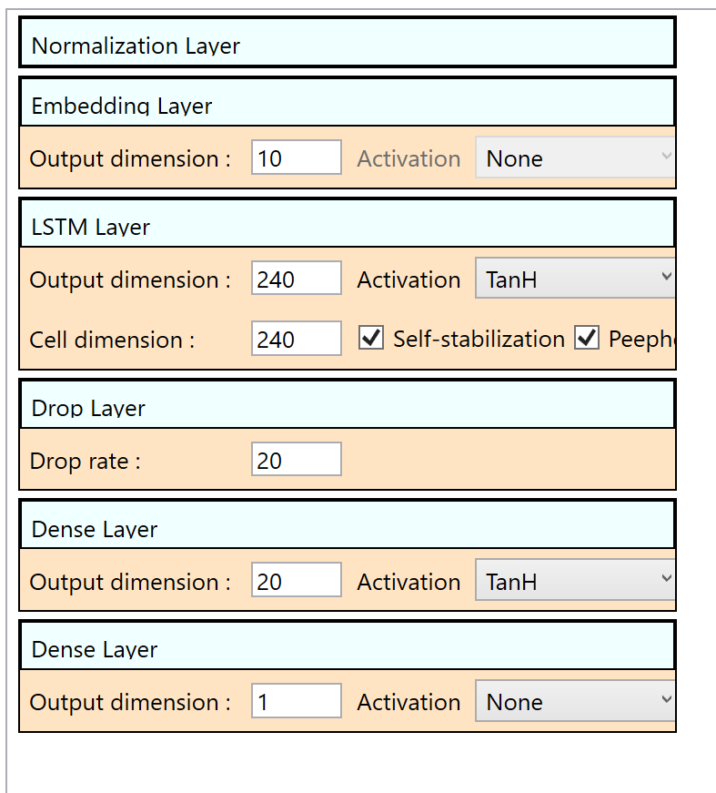

The last layer in the sequence must be the output layer.

Example of bike sharing network model
-------------------------------------

The Bike Sharing example can be found and opened from the Start Page of
ANNdotNET GUI Tool. The graphical representation of the model is shown on the
image above. The following text describes the network model in the mlconfig
file:

>   network:\|Layer:Normalization 0 0 0 None 0 0 \|Layer:Embedding 10 0 0 None 0
>   0 \|Layer:LSTM 240 240 0 TanH 1 1 \|Layer:Drop 0 0 20 None 0 0 \|Layer:Dense
>   20 0 0 TanH 0 0 \|Layer:Dense 1 0 0 None 0 0

The model is defined as: EmbeddedLSTM network which has several different layers
in the network. Since we are dealing with numerical data, the first layer is
Normalization which normalizes the numerical features’ value. Only numerical
values are normalized with this layer, which means other categorical features
are remain the same. Then the Embedding layer is added in order to reduce the
features number, since we have 40 features. With embedding layer, we reduce 40
features to 10, and then we add LSTM layer with 240 output dimensions. After
LSTM we add some dropout and dense layers. Since the label layer has dimension
of 1, the last layer in the network must match the output layer dimension. The
last layer doesn’t have activation function, since we except the any value.

learning:
=========

The learning: keyword defines the learning parameter. The signature of the
keyword is the following:

>   learning:\|Type:[name] \|LRate:[value] \|Momentum:[value] \|Loss:[funname]
>   \|Eval:[funname]

The learning keyword has 5 parameters:

1.  Type – defines the learning type. Currently supported learners: (SGDLearner,
    MomentumSGDLearner, FSAdaGradLearner, AdaGradLearner, AdamLearner)

2.  LRate: - indicates the learning rate which represent the real value. Example
    (\|LRate:0.01)

3.  Momentum – defines momentum for the learner. Example (\|Momentum:0.9)

4.  Loss: - defines the loss function for the learner. Example
    (\|Loss:SquaredError).

5.  Eval: - defines the function during testing and evaluation for the model.

Currently supported loss and evaluation functions defined directly in CNTK
library:

1.  SquaredError -used for regression models,

2.  ClassificationError - for classification problems

3.  BinaryCrossEntropy - Computes the binary cross entropy (aka logistic loss)
    between the output and target,

4.  CrossEntropyWithSoftmax - computes the cross entropy between the
    target_vector and the softmax of the output_vector.

Several additional custom functions are implemented, and they can be used in
training models:

1.  RMSError - root mean square error,

2.  MSError - mean squared error.

Example of learning parameters 
-------------------------------

Example of learning parameters in ANNdotNET GUI tool for Bike Sharing looks
like:

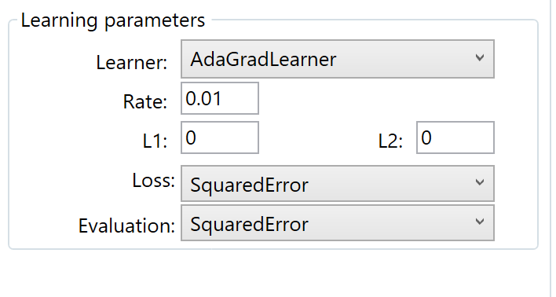

The same set of parameters in mlconfig file looks like:

>   learning:\|Type:AdaGradLearner \|LRate:0.01 \|Momentum:0.9
>   \|Loss:SquaredError\|Eval:SquaredError\|L1:0\|L2:0

The learner type is AdaGradLearner, with 0.01 of learning rate, and 0.9 of
momentum. The loss function is Squared error, and the evaluation function is
Squared error.

training:
=========

The training: keyword defines the training parameters. Typical training
parameters defined in mlconfig file are:

>   training: \|Type:[type] \|BatchSize:[number] \|Epochs:[number]
>   \|Normalization:[Feature1 Feature2 …] \|SaveWhileTraining:[0/1]
>   \|RandomizeBatch:[0/1] \|ProgressFrequency:[0/1] \|FullTraininfSetEval:[0/1]

The first parameter is the type which indicates should we used default, or
custom implemented minibatch source. Possible values (custom, default).

The BatchSize defines the size for the batch for the trainer. Possible values
are 1 to size of training data set. Example (\|BatchSize:125)

The Epoch: defines the number of cycles the trainer processes all samples from
the training dataset. Example (\|Epochs:12)

The Normalization: defines if the network model contains the Normalization layer
which will normalize the data. Normalization layer is described
[here](https://bhrnjica.net/2018/07/13/input-normalization-as-separate-layer-in-cntk-with-c/).

SaveWhileTraining: - indicates if the MLFactory will save models during training
process. This option should be used when we expect the model will be
overstrained during training.

RandmizeBatch: - indicates if the batch will be generated randomly during
training.

ProgressFrequency: - defines how progress will be sent to caller, in order to
report about training progress.

Simple example of training keyword which is defined in Solar production example:

training:\|Type:default \|BatchSize:500 \|Epochs:1000 \|Normalization:0
\|RandomizeBatch:False \|SaveWhileTraining:1 \|ProgressFrequency:2
\|ContinueTraining:0
\|TrainedModel:models\\model_at_81of1000_epochs_TimeSpan_636720261828457405

Training process is defined with default implemented minibatch source, with 500
size of batch which will not be randomized, with no normalization, with saving
models during training, and report progress every 2 epochs. The following image
shows the training parameters in GUI tool:

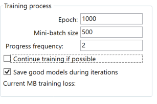

Normalization in ANNdotNET 
===========================

Simple said, data normalization is set of tasks which transform values of any
feature in a data set into predefined number range. Usually this range is [-1,1]
, [0,1] or some other specific ranges. Data normalization plays very important
role in ML, since it can dramatically improve the training process, and simplify
settings of network parameters.

There are two main types of data normalization:

-   MinMax normalization - which transforms all values into range of [0,1],

-   Gauss Normalization or Z score normalization, which transforms the value in
    such a way that the average value is zero, and standard deviation is 1.

Beside those types there are plenty of other methods which can be used. Usually
those two are used when the size of the data set is known, otherwise we should
use some of the other methods, like log scaling, dividing every value with some
constant, etc. But why data need to be normalized? This is essential question in
ML, and the simplest answer is to provide the equal influence to all features to
change the output label. More about data normalization and scaling can be found
on this
[link](https://www.coursera.org/lecture/data-genes-medicine/data-normalization-jGN7k).

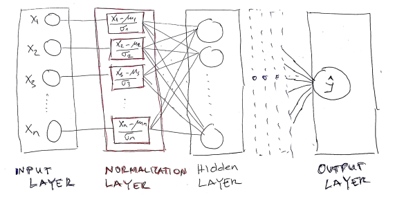

As can be observed, the Normalization layer is placed between input and first
hidden layer. Also the Normalization layer contains the same neurons as input
layer and produced the output with the same dimension as the input layer.

In order to implement Normalization layer, the following requirements must be
met:

-   calculate average 

    

    and standard deviation

    

    in training data set as well find maximum and minimum value of each feature.

-   this must be done prior to neural network model creation, since we need
    those values in the normalization layer.

-   within network model creation, the normalization layer should be define
    after input layer is defined.

Calculation of mean and standard deviation for training data set
================================================================

Before network creation, we should prepare mean and standard deviation
parameters which will be used in the Normalization layer as constants.
Hopefully, the CNTK has the static method in the Minibatch source class for this
purpose “MinibatchSource.ComputeInputPerDimMeansAndInvStdDevs”. The method takes
the whole training data set defined in the minibatch and calculate the
parameters.

//calculate mean and std for the minibatchsource

// prepare the training data

var d = new DictionaryNDArrayView, NDArrayView\>\>();

using (var mbs = MinibatchSource.TextFormatMinibatchSource(

trainingDataPath , streamConfig, MinibatchSource.FullDataSweep,false))

{

d.Add(mbs.StreamInfo("feature"), new Tuple(null, null));

//compute mean and standard deviation of the population for inputs variables

MinibatchSource.ComputeInputPerDimMeansAndInvStdDevs(mbs, d, device);

 

}

Now that we have average and std values for each feature, we can create network
with normalization layer. ANNdotNET library supports multiple group of features.
For example, the input variables can consist of categorical and numerical
features. In case of categorical features, normalization should not be applied,
so normalization layer should be created only for numerical group of features.

The following example shows two groups of features Item and Sale.

>   \|Item 1 0 0 0 0 0 0 0 0 0 \|Sale 18 10 14 6 5 18 14 6 4 19 12 20 19 12 2 6
>   16 9 13 10 2 5 5 5 6 6 10 9 12 4 \|item_cnt 3

As can be seen we have Item which is typical categorical variable represented
with One-Hot encoding vector, and Sale features which is numerical group of
features.

The MLConfig file should be defined as:

>   features:\|Item 10 0 \|Sale 30 0

>   labels:\|item_cnt 1 0

Based on the above sample, we should define normalization only for Sale feature.
So, the training parameters may be defined as:

>   training: \|Type: default \|BatchSize: 480 \|Normalization:Sale
>   \|Epochs:1000 \|SaveWhileTraining: 1 \|RandomizeBatch: 1
>   \|ProgressFrequency: 1 \|FullTrainingSetEval:1

As can be seen Normalization contains only features group which is numerical.
For example in case there are two numerical features group Sales and Prices,
normalization would be defined as: \|Normalization:Sale;Prices.

Note: features group are separated with semicolon.

Paths in mlconfig 
==================

The last keyword is paths, which contains file paths for correctly working
mlconfig.

1.  Training: - path of the training dataset file

2.  Validation: - path of the validation dataset file¸

3.  Test: - path of the test dataset file used for evaluation

4.  Tempodels: - path where models are stred during training process

5.  Models: - path where sored the best model once the training process finished

6.  Result: - full path name where the result of the evaluation process stored.

7.  Logs – path of log folder. Location of log files.

The last 6 keywords are self-explained and example of using them are presented
in the case of solar production example:

>   paths:\|Training:data\\solar_cntk_train.ctf
>   \|Validation:data\\solar_cntk_val.ctf \|Test:data\\solar_cntk_test.ctf
>   \|TempModels:temp_models \|Models:models
>   \|Result:solar_production_result.csv \|Logs:log

As can be seen, paths define training, validation and testing data sets, storing
models during training and final stage. And the path where the result will be
stored when the model will be evaluated.

Other information about mlconfig file
=====================================

The mlconfig file can define comments, which are important during explanation
about some parameters and options. All examples provided in the MLFactory
solution are commented and each parameters is explained.

Beside comment very important information is separator. There are three kinds of
separators:

1.  ‘:’ -double point

2.  ‘\|’ -vertical line,

3.  ‘ ‘ - space,

4.  ‘;’ semicolon.

Double point separates the keyword and set of parameters, as well as parameters
names of their values.

Vertical line separates keyword parameters.

Space separates parameter values, and semicolon separated list of values for the
parameter.

So, let’s see the following example:

>   network:\|Layer:LSTM 240 240 0 TanH 1 1 \|Layer:Dense 20 0 0 TanH 0 0

Network keyword is separated by ‘:’ from its parameters (\|Layer…..). Then ‘\|’
separates different network layers (:\|Layer:LSTM 240 240 0 TanH 1 1, \|Layer:
Dense 20 0 0 TanH 0 0). Each network layer is separated by vertical line \|.
Each layer’s parameters are separated by space. In case the parameter has list
of values element list are separated by semicolon.

**Note: After double point space is not allow.**

Components of ANNdotNET solution
================================

ANNdotNET solution consists of several projects and components. All projects in
the solution ends with three suffixes:

-   .core or .lib - those project is configured for .NET Core Framework

-   .net - project are configured for .NET Framework, and it is fully compatible
    for .NET Core.

-   .wnd – those project are configured for .NET Framework, and contains
    WinForms or WPF components.

The reason of having two project version for the same code is, since in time
this manual is written, the latest release of CNTK supports .NET Framework only.
Once the CNTK would supports the .NET Core, ANNdotNET will support it as well.
doc – folder contains documentation for the solution.

1.  nnnetwork.core.net(nnnetwork.core) – implement core concept of the CNTK
    neural network by providing higher API, to create various networks
    configuration, learning and training parameters.

2.  dataprocessing.core and dataprocessing.wnd projects are related for data
    preparation. They transform the raw dataset into ml-ready dataset.

3.  anndotnet.lib.ext.net(anndotnet.lib.ext)-extension component which can be
    used for custom network implementation, specific to the problem. Sometimes
    network designer of ANNdotNET cannot design the network, so in that
    situation the user can implement manualy using ml-configuration file only.
    Usually the extension is used when custom neural network model is
    implemented.

4.  anndotnet.core.net (anndotnet.core) – component consist of specific
    implementation, where the main concept relies on machine learning
    configuration file (mlconfig file).

5.  anndotnet.lib.net (anndotnet.lib) – component consist of specific
    implementation related for handling project and multiple mlfonfiguration
    file within the same project. The component is mostly related for Windows
    Desktop application.

6.  anndotnet.app – client app which provides implementation how to use
    anndotnet using console app, and command line. The ANNdotNET Tool is
    supposed to be cross OS tool which can be run on any OS .NET Core supports.

7.  anndotnet.wnd windows desktop application which provides rich set of option
    to training, validate and evaluate mlconfigurations.

8.  anndotnet.unitest and related test application - vs projects consist of unit
    test methods and testing code of the solution.

nnetwork.core project
=====================

nnetwork.core project contains CNTK based API for creating neural network.
Furthermore, the project consists of:

-   Feedforward network implementation

-   LSTM Recurrent network implementation

-   NNParameters class which implements NN parameters needed for handling
    network model

-   StatMetrics – set of custom defined CNTK function for evaluate and train nn
    models.

-   ProgressData class implementation

ProgressData
------------

The ProgressData contains properties which is passed by progress writer method
back to the client, in order to show the current state of the trainer. The
ProgressData class contains the following information:

-   EpochTotal – total number of epoch, defined in the ML configuration file.

-   EpochCurrent – current epoch, which trainer has been processed,

-   EvaluationFunName- the name of the Evaluation function, defined by the
    learning parameters, in the ml config file.

-   MinibatchAveragegeEval and MinibatchAverageLoss – evaluation and loss values
    of the current processed minibatch.

-   TrainEval– value returned the evaluation function against whole training
    dataset during model testing,

-   ValidationEval – value returned the evaluation function against whole
    training dataset during model testing,

mlfactorylib.network.extension
==============================

This project extends the implementation of anndotnet.cor.net project in case the
current implementation, and ML configuration file cannot implemented desired
neural network model. Typical example of such solution are “Predict Future
Sales” which implements custom NN model. The example of the custom model can be
found in the project. The extension project uses the network.core.net project,
but it is not dependent of the anndotnet.core.net. With such dependency we can
implement custom neural network model, referenced it with the client app
(ASP.NET or other Application) and use it as ordinary ML solution by providing
the ml configuration file and custom neural network implementation.

anndotnet.core.net
==================

anndotnet.core.net is central project of the ANNdotNET solution, since it
implements all machine learning steps. The project contains the following class
implementations:

-   MachineLearning class implementation,

-   MLFactory class implementation,

-   MLTrainer class implementation,

-   MinibatchSourceEx class implementation.

MinibatchSourceEx
-----------------

The class implements the unique way of feeding the trainer. It extends the
current TextFormatMinibatchSource CNTK implementation of txt file-based reader
for feeding the trainer. Currently there are two types of minibatch:

-   default - which is based on default CNTK TextFileMinibachSource,

-   custom – which is based on custom implemented MinibachSource for sequence of
    variables length which is not supported by TextFileMinibachSource CNTK
    minibatch.

The MinibatchSourceEx contains methods:

-   Constructor – for creation the object,

-   GetNextMinibatch – common method for the trainer. It returns chunk of data
    specified by the MinibatchSize values.

-   GetFullBatch – returns whole dataset for validation and testing,

-   NormalizeInput – methods for input normalization and creation Normalization
    layer.

MLTrainer
---------

Thet MLTrainer class implements only two public methods:

-   CreateTrainer – the method searches previous checkpoint state of the trainer
    in case the user want to continue training from the previous try. Otherwise,
    create brand new trainer by using current training and learning parameters.

-   Train – method starts the training process. During training, trainer sends
    the training progress as the ProgressData object so the client knows what is
    going on with training. Once the training process is completed, it returns
    the TrainResult object which contains the information about:

-   ProcessState - how the training process ended (completed, stopped, crashed)

-   Iteration - the last iteration before trainer ends,

-   BestModel - file path of the best-found model.

MLFactory 
----------

The class implements basic actions for creating all machine learning components:

-   Loading ml configuration files into memory,

-   Streams needed for defining input and output variables,

-   Network models,

-   Learning parameters,

-   Training parameters

-   Other ML configuration files options.

MLFactory class defines set of static methods which are independent form each
other, since it performs unique task. At the beginning MLFactory class object
must be created:

//create factory object

MLFactory f = new MLFactory();

Once the object is created, the method CrateIOVariables can be called in order
to create input and output variables which are needed for further ML tasks.

//extract features and label strings and create CNTK input variables

var strFeatures = dicMParameters["features"];

var strLabels = dicMParameters["labels"];

//create config streams

f.CreateIOVariables(strFeatures, strLabels, DataType.Float);

The method requires two string which define input and output variables which are
parsed and created within the method.

Once the Input and Output variables are created the rest of the ML steps are
straight forward.

Machine Learning Configuration File (mlconfig)
==============================================

ANNdotNET Tool
==============

MachineLearning class 
----------------------

The MachineLearning class is statically defined class with two methods:

-   Run – for run training process, which is previously described.

-   EvaluateModel for model evaluation and exporting the results.

EvaluateModel is called by providing the arguments about input and output
variables, MinibatchSource, path of the best model, path of the dataset, and
path where the result will be stored.
